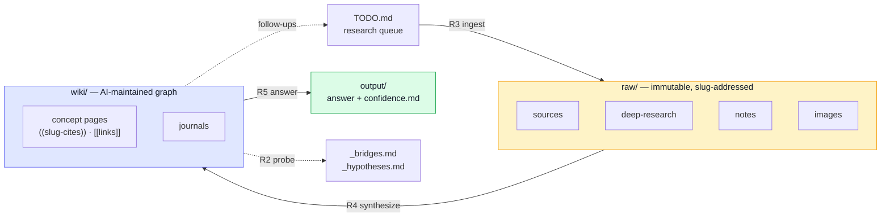

<div align="center">

<h1>Researcher-Brain</h1>
<a href="./images/researcher=brain.img"></a>
<p><em>A second brain for research — built for the era when AI doesn't just <strong>retrieve</strong> knowledge, it <strong>produces</strong> it.</em></p>

<p>
  <a href="./CONTRIBUTING.md"></a>
  <a href="./CONVERGENCE.md"></a>
  <a href="https://logseq.com"></a>
  <a href="#examples"></a>
</p>

<p>
  <a href="#quickstart"><b>Quickstart</b></a> ·
  <a href="#how-it-works"><b>How it works</b></a> ·
  <a href="#examples"><b>Examples</b></a> ·
  <a href="#contributing"><b>Contributing</b></a>
</p>

</div>

---

In three months of 2026, three events in three different fields turned out to
describe the same shape. Karpathy shipped [`autoresearch`](https://github.com/karpathy/autoresearch)
and Fortune named the **propose → run → measure → commit-or-rollback** pattern
*the Karpathy Loop*. Weeks later he showed the **same loop** curating an
AI-maintained wiki instead of training code. Then a general reasoning model
disproved an 80-year-old Erdős conjecture — no fine-tuning, no scaffolding.

The throughline: **once your knowledge is structured well enough to run the
loop on it, the bottleneck stops being the model and starts being your corpus.**
Researcher-Brain is that structure.

> The full three-act story — and the bet the design makes — lives in **[CONVERGENCE.md](./CONVERGENCE.md)**.

---

## What this is

`Researcher-Brain` is a generic, reusable scaffold for building a collaborative
research wiki on **any** topic — medicine, ML, history, law, design, cooking,
anything where evidence accumulates and adjacencies matter. You work it the way
Karpathy described his own system: drop in raw material, point an AI agent at
it, and let it read, organize, summarize, cross-link, and surface things you
wouldn't see alone.

The skeleton is three folders and three documents:

```
Researcher-Brain/
├── AGENTS.md              ← how any AI agent should behave in here
├── program.md             ← named routines (R0–R8) the agent runs
├── domain.md              ← (produced by R0) customization for YOUR topic
├── raw/                   ← primary evidence, immutable, slug-addressed
│   ├── sources/           ← published primary sources (papers, books, RFCs,
│   │                        case law, archives, official filings, …)
│   ├── images/            ← figures, diagrams, scans, screenshots
│   ├── deep-research/     ← long-form AI investigations (Claude, GPT, Gemini)
│   └── notes/             ← human contributions
├── wiki/                  ← Logseq graph, AI-maintained
│   ├── pages/             ← concept pages with [[wiki-links]] and ((slug-cites))
│   ├── journals/          ← daily research log
│   └── assets/
└── output/                ← deliverables answering questions you actually asked
```

---

## How it works

Evidence lands in `raw/` and never moves. The agent synthesizes it into the
`wiki/`, where structure lives and adjacencies surface. Your questions get
answered into `output/`, with citations that trace all the way back to disk.
And the whole thing runs on a loop: the agent pulls from `TODO.md`, researches,
files the result, and feeds the follow-on questions back into the queue.



The three layers map cleanly onto Karpathy's:

| Karpathy's layer        | Here                                             | Why                                                          |
| ----------------------- | ------------------------------------------------ | ------------------------------------------------------------ |
| Raw sources (immutable) | `raw/` (flat, slug-addressed, never reorganized) | Stable IDs let citations from anywhere keep working forever. |
| AI-maintained wiki      | `wiki/` (Logseq markdown graph)                  | Plain markdown so it survives the death of any single tool.  |
| Schema / conventions    | `AGENTS.md` + `program.md` + `domain.md`         | Three files because conventions, routines, and topic differ. |

---

## What makes this different from "just a wiki"

A normal personal wiki is a place a single mind puts things. This one is a
workbench for multi-source collaboration — your notes, multiple AIs'
deep-research reports, primary sources, and images, all carrying enough
provenance to answer the question that matters at 2 a.m.: *where did this claim
come from, and how confident should I be?*

Six design choices that earn their keep:

- **Provenance is first-class.** Every artifact in `raw/` declares its type, its
  source, and — for AI investigations — the verbatim prompt that produced it. A
  deep-research report whose citations don't resolve gets downgraded to a
  hypothesis; a human note carries its author and context. The wiki keeps these
  gradients visible.
- **Slug-addressed evidence, never reorganized.** Every artifact gets a stable
  slug (`doi-10.1038-s41586-023-12345`, `rfc-9110`,
  `claude-2026-05-25-attention-mechanisms`). The wiki cites slugs; slugs never
  move; so the wiki can be reorganized freely without breaking a single
  citation. That's the difference between "I'll fix the links later" and a
  corpus that compounds for years.
- **The loop is built in, not bolted on.** `R0` seeds a `TODO.md`; the agent
  picks an item, produces a deep-research artifact, lands it in `raw/`, journals
  a breadcrumb, closes the item, and feeds follow-on questions back into the
  queue. The Karpathy Loop, applied to knowledge instead of training code.
- **The wiki is allowed to be wrong — and the audit trail proves it.** `R6:
  improve-wiki` re-clusters concepts, merges tag synonyms, prunes dead stubs,
  and re-checks whether thinly-backed claims are still labeled hypotheses rather
  than findings. Wikis decay; this one is built to.
- **Cross-domain probe (opt-in).** `R2` walks the graph for *under-explored
  adjacencies* — concept pairs bridging two sub-fields where a connection is
  implied but never cited. Probiotics next to mood disorders; an architectural
  tweak next to an unclaimed benchmark gain; a doctrine that jumped
  jurisdictions earlier than the textbooks say. This routine is why the template
  exists.
- **Outputs carry their own confidence file.** Every deliverable in `output/`
  ships a `confidence.md`: what we know, what's weak, what would change the
  conclusion. Without it, an answer is a confident-sounding paragraph; with it,
  it's a position.

---

## Quickstart

```bash
# 1. Clone or copy this template into a new folder for your topic.
cp -r Researcher-Brain MyResearchProject
cd MyResearchProject

# 2. Open the folder in your AI assistant (Claude, Cursor, Cowork, etc.).
#    Tell it: "Read AGENTS.md and run R0."

# 3. Answer the six R0 questions honestly. Don't pre-shape your topic to
#    sound impressive — the system pays off on precision, not breadth.

# 4. When R0 finishes, drop a few primary sources into raw/_inbox/
#    and say: "Run R3 on the inbox."

# 5. Open TODO.md. R0 seeded it with sections derived from your
#    concept_categories. Add a handful of specific items to steer the
#    early corpus, or leave it and let the loop steer.

# 6. Say: "Run the loop." The agent picks a queued item, produces a
#    deep-research artifact in raw/, journals a breadcrumb, closes the
#    item, and adds any follow-on questions back into TODO.md. Let it
#    run as long as you want.

# 7. Once you have ~10 artifacts in raw/, ask your first real question.
#    The agent runs R5 and you get an answer with citations and a
#    confidence file.

# 8. After a few weeks, ask: "Run R2." If your domain.md has
#    cross_domain: true, the agent walks the graph and tells you what
#    adjacencies you've accidentally built evidence for.
```

The first few weeks are slow. The compounding starts somewhere between a hundred
and three hundred artifacts — roughly where Karpathy noticed his own wiki
started returning more than it cost to maintain.

---

## The routine catalog

| Routine                    | What it does                                                                                                    |
| -------------------------- | --------------------------------------------------------------------------------------------------------------- |
| `R0: init`                 | The interview. Produces `domain.md`. Run once per project.                                                      |
| `R1: continue-on`          | Deepen coverage of a concept the operator already cares about.                                                  |
| `R2: cross-domain-probe`\* | Find under-explored adjacencies between sub-fields. **The signature routine.**                                  |
| `R3: ingest`               | Slug, metadate, file, and index a new artifact (source / image / deep-research / note).                         |
| `R4: synthesize`           | Promote journal bullets into durable concept pages.                                                             |
| `R5: answer`               | Produce an `output/<date>-<question-slug>/` deliverable with a confidence file.                                 |
| `R6: improve-wiki`         | Tidy. Re-cluster concepts, normalize tags, audit provenance, prune stubs.                                       |
| `R7: knowledge-graph`      | Render the current concept graph; flag hubs, bridges, and isolates.                                             |
| `R8: build-wiki-tool`      | When a manual chore has recurred ≥2×, turn it into a script in `scripts/`. The only routine that produces code. |

\* R2 is gated on `cross_domain: true` in `domain.md`.

The full procedural detail for each routine lives in `program.md`. The loop that
consumes `TODO.md` is described in `AGENTS.md` §10.

---

## R0: the init interview

The template is generic. The first time you (or an agent) open the folder, you
run `R0: init` — a six-question interview that produces `domain.md`, the small
schema file that customizes everything for your actual topic:

1. **What are you researching?** One or two sentences.
2. **What kinds of things do you study?** 2–5 categories (medicine has
   *interventions* / *systems* / *conditions*; ML has *techniques* / *models* /
   *benchmarks*; law has *doctrines* / *cases* / *jurisdictions*).
3. **What sub-fields cut across this topic?** 3–8 specialties where experts
   would disagree about who owns what.
4. **Where does the best primary evidence live?** 2–5 databases / archives
   (PubMed, arXiv, JSTOR, an official archive, an RFC index…).
5. **Cross-domain mode on or off?** On for multi-disciplinary topics; off for
   deep single-discipline dives.
6. **What's the first thing you want this system to help with?** Optional. Seeds
   the first real R1 or R5 after init.

The agent reads your answers back, lets you correct them, writes `domain.md`,
and creates a stub `wiki/pages/_index.md`. From then on, every other routine
reads `domain.md` and behaves accordingly. See `domain.md.example` for three
filled-in versions across medicine, ML, and history.

---

## Examples

Real research brains people are growing in the open. Point your AI agent at one
to see how a mature corpus is shaped — then **[add your own](#contributing)**.

| Project                | Author    | Domain          | Notes                                  |
| ---------------------- | --------- | --------------- | -------------------------------------- |
| _Your wiki could be the first entry_ | _[@you](https://github.com)_ | _e.g. immunology_ | _Open a PR — see below_ |

**Add yours:** fork the repo, add one row to the table above, and open a pull
request titled `showcase: <project name>`. Keep the description to a single
line; the entry should link to a **public, live** Researcher-Brain (a populated
`wiki/` and `raw/`, even a small one). Full details in
[CONTRIBUTING.md](./CONTRIBUTING.md).

---

## Contributing

Two ways in, both welcome:

1. **Show what you built** — add your live wiki to the [Examples](#examples)
   table. This is the highest-signal contribution: it shows newcomers what a
   real corpus looks like in a domain they care about.
2. **Improve the template** — sharpen a routine, add a `domain.md.example` for a
   new field, contribute a script that follows the R8 contract, or make the
   docs clearer.

The full guide — submission format, ground rules, and how to open a PR — is in
**[CONTRIBUTING.md](./CONTRIBUTING.md)**.

---

## What this isn't

- **Not a way to outsource your thinking.** The wiki, the routines, the
  cross-domain probe — all of them are designed to make *you* think more
  carefully, not less. A confidence file forces you to admit what you don't
  know; a bridge surfaces a question you still have to answer.
- **Not a literature-review service.** R1 deepens coverage, but the goal is
  never to summarize a field exhaustively — it's to surface what matters and
  (if you opted into R2) what's adjacent.
- **Not a substitute for domain expertise.** You still have to know what you're
  looking at. The system makes your expertise more leveraged, not optional.
- **Not a place for material you don't have rights to.** If a source can't be
  stored, save `meta.yaml` and `notes.md` with the URL and skip the artifact
  file.

---

## Credits

This template combines Karpathy's loop with Karpathy's three layers, stands on
Tiago Forte's CODE framework, targets Logseq's plain-markdown graph, and treats
the DOI / PMID / arXiv / ISBN / RFC / case-docket identifier systems as
first-class slugs. The full attributions — and the sources behind the three
2026 events — are in **[CONVERGENCE.md](./CONVERGENCE.md)**.

---

<div align="center">

**Build the corpus your thinking will compound on, and let the loop run on it.**

Questions, or want to help? Open a PR, or reach out at
**[virion.ai/initiate](https://virion.ai/initiate)**.

</div>
